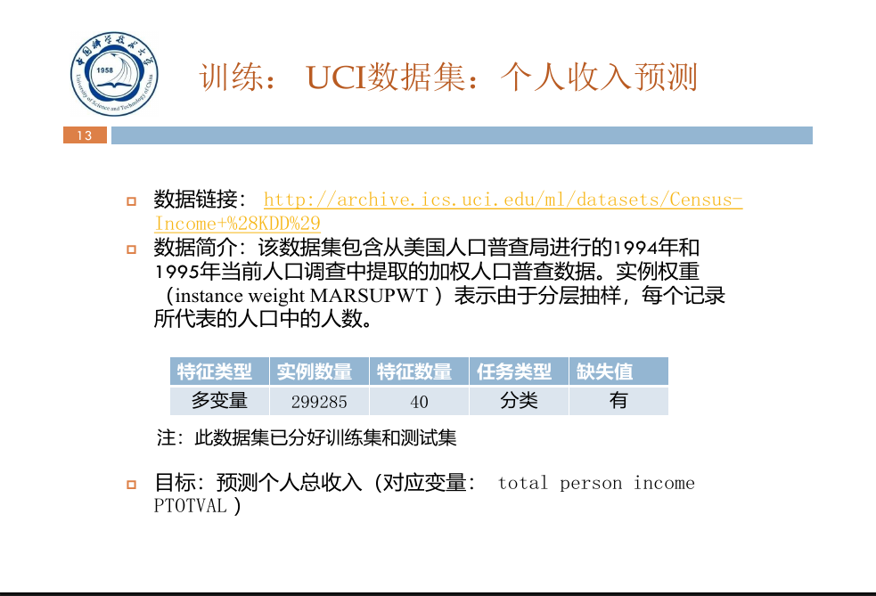

# 数据科学导论实验

## 1.实验要求如下:

## 2.总进度:<progress value="5" max="100"></progress>

- [ ] 数据探索
- [ ] 特征工程
- [ ] 模型选择
- [ ] 模型优化
- [ ] 模型融合

### 2.1.数据探索(20%)<progress value="5" max="20"></progress>

对比, 分组, 频数, 抓大放小, 可视化

- [x] 数据整体认知

  研究**训练集, 测试集, 表数, 记录数, 用户数, 变量数, 变量类型, 变量属性, 变量属性值, 标签**

- [ ] 数据质量分析

  分析数据的**缺失值, 重复值, 异常值, 歧义值, 正负样本比例**

- [ ] 数据统计量分析

  对**单个变量, 两个变量, 多个变量**之间关系的统计分析

- [ ] 数据分布分析

  

### 2.2. 特征工程(40%)<progress value="0" max="30"></progress>

- [ ] 数据预处理
	- 数据清洗
		- 缺失值插补, 异常值删除
		- *小技巧:用训练集数据学习一个模型, 然后预测训练集标签, 删除预测结果偏差较大的样本*
	- 数据变换:
		- Ln, Log
		- One-hot encoding
		- 连续变量离散化
	- 数据规范化:
		- Min-Max
- [x] ~~特征构造(难)~~
	
- [ ] 特征选择
	- 过滤式选择: Person Correlation Coefficient
	- 包装式选择: 遗传, 退火
	- 嵌入式选择: Lasso Regression, GBDT, XGBoost

### 2.3. 模型选择(10%)<progress value="0" max="10"></progress>

### 2.4. 模型优化(20%)<progress value="0" max="30"></progress>

#### 2.4.1.评估方法:
- 留出法
- 自助法
- ~~交叉验证法~~

#### 2.4.2.性能度量:
- Acurracy
- F1
- AUC
- Logioss
- K-S
- Kappa

#### 2.4.3.参数调整:
- 网格搜索
- ~~贝叶斯优化~~
- ~~启发式算法~~
### 2.5. 模型融合(10%)<progress value="0" max="10"></progress>

- 加权平均
- Bagging
- Boosting
- Blending
- ~~Stacking~~

## 3. 完成并提交实验报告